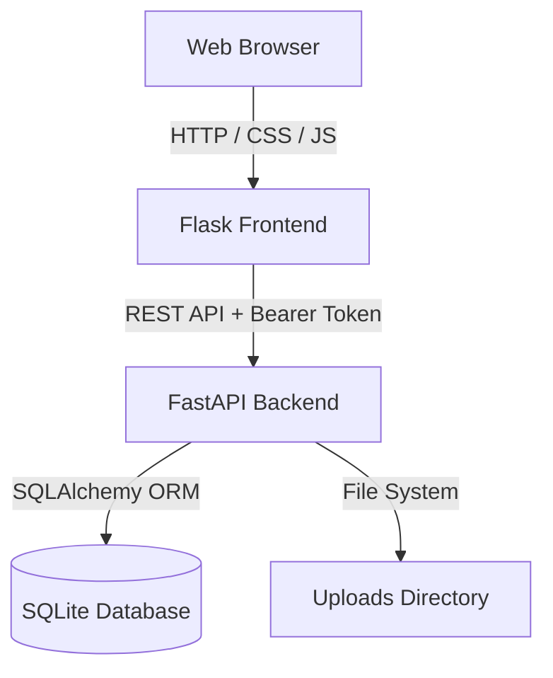

# gamis — Gem and Mineral Inventory System

`gamis` is a lightweight, responsive web application for cataloging, managing, and searching gem and mineral inventories. It features a modern, clean UI, JWT-based user authentication, role-based access control, user management, and custom item tracking.

## Architecture

The project is structured with a decoupled frontend and backend running in Docker containers:



## Features

- **Dashboard & Inventory Management**: View, add, edit, and delete gems, minerals, or meteorites. Track parameters like weight, date acquired, cost price, selling price, and photos.
- **Client-Side Instant Search**: Filter items instantly by name, category, or **Custom ID**.
- **Admin User Management**: Admin users can access a dedicated user management dashboard to add, edit roles, or delete users.
- **Mobile-Responsive Design**: Smooth responsive layouts featuring a collapsing hamburger navigation drawer on mobile and responsive vertical grids for detail views.
- **Security & Safety Guardrails**:
  - Direct endpoint authorization validation.
  - Prevention of demoting, renaming, or deleting the original `admin` user.
  - Prevention of self-deletion for logged-in administrators.

## Technology Stack

- **Frontend**: Flask, Requests, Vanilla CSS (Custom properties, theme support, flexbox/grid), Vanilla JavaScript.
- **Backend**: FastAPI, SQLite (via SQLAlchemy), Pydantic validation, JWT tokens (python-jose), bcrypt hashing.
- **Infrastructure**: Docker, Docker Compose.

## Getting Started

### Prerequisites

- [Docker](https://docs.docker.com/get-docker/)
- [Docker Compose](https://docs.docker.com/compose/install/)

### Running the Application

1. Clone or download the repository.
2. Run the services from the project root:
   ```bash
   docker compose up --build -d
   ```
3. Access the web interface at `http://localhost:5000`.
4. The backend service runs at `http://localhost:8000`.

### Initial Setup & Admin Credentials

On the first start, if no database exists, the backend generates an initial database and prints the auto-generated password for the default `admin` user to stdout. You can inspect the logs to find it:

```bash
docker compose logs backend
```

Look for the following output block:
```text
============================================================
GAMIS INITIAL SETUP: GENERATED ADMIN CREDENTIALS
Username: admin
Password: <auto-generated-password>
============================================================
```
